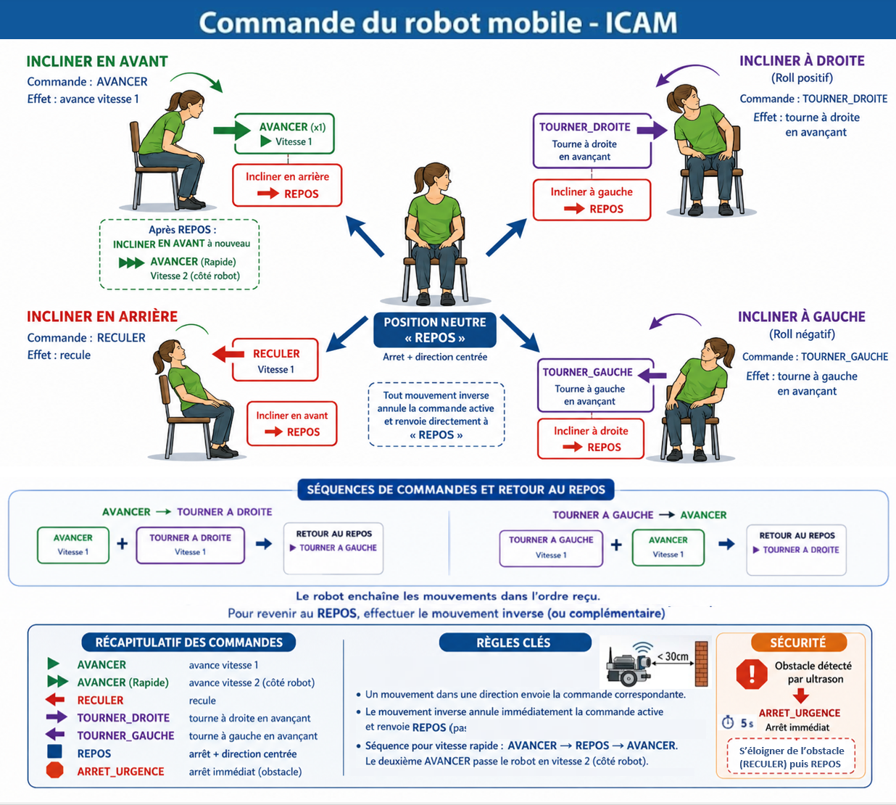

# Systeme de controle IMU pour robot mobile

Ce projet vise a commander un robot mobile a partir de gestes du corps mesures par des capteurs inertiels IMU avec un microphone pour un stop d'urgence et capteur ultrason pour la détection d'obstacle.

Mouvements attendu et Commande du robot mobile :


Le systeme est separe en deux Raspberry Pi 4 :

- **Pi4 humain** : lecture des IMUs, calibration, detection des gestes, journalisation CSV et envoi des commandes.
- **Pi4 robot** : reception des commandes TCP, pilotage des moteurs et du servo, detection d'obstacle par ultrason et securite watchdog.

Caracteristiques principales :

- lecture IMU a **100 Hz** ;
- communication reseau en **TCP sur le port 5000** ;
- envoi d'une commande uniquement lorsqu'elle change ;
- fonctionnement possible avec **1 a 3 IMUs** ;
- calibration interactive de la posture neutre ;
- journalisation CSV pour analyser les essais et ajuster les seuils.

---

## Architecture du projet

```text
IMUs_vocal_final/
|-- main_pi4_humain.py       # Programme principal du cote utilisateur
|-- main_pi4_robot.py        # Programme principal du cote robot
|-- imu_reader.py            # Lecture des MPU-6050 via le multiplexeur TCA9548A
|-- gesture_detector.py      # Filtrage, detection de gestes et logique d'annulation
|-- calibration.py           # Calibration des offsets et de la posture neutre
|-- tcp_sender.py            # Emission des commandes TCP vers le robot
|-- data_logger.py           # Enregistrement des donnees de session au format CSV
|-- Voice.py                 # Essais et fonctions lies a la commande vocale
|-- sensors/
|   `-- ultrason_sensor.py   # Lecture du capteur HC-SR04 cote robot
|-- logs/                    # Sessions CSV generees pendant les essais
|-- calibration_offsets.json # Fichier genere apres calibration
`-- icam_robot.log           # Journal d'execution, si active
```

---

## Materiel requis

| Composant | Quantite | Role |
|---|---:|---|
| Raspberry Pi 4 | 2 | un Pi cote humain, un Pi cote robot |
| MPU-6050 | 1 a 3 | mesure des mouvements du corps |
| TCA9548A | 1 | multiplexage I2C des IMUs |
| Adeept Robot HAT | 1 | pilotage des moteurs et du servo |
| HC-SR04 | 1 | detection d'obstacle cote robot |
| Moteurs DC | 2 | propulsion du robot |

---

## Connexions materiel

### Pi4 humain : TCA9548A et IMUs

```text
Raspberry Pi 4          TCA9548A
3.3V            ------  VIN
GND             ------  GND
GPIO2 / SDA     ------  SDA
GPIO3 / SCL     ------  SCL
```

| Canal TCA9548A | Nom dans le code | Placement |
|---:|---|---|
| 0 | `left_shoulder` | epaule gauche |
| 1 | `right_shoulder` | epaule droite |
| 2 | `back` | torse |

Chaque MPU-6050 est alimente en `3.3V`. Les broches `SDA` et `SCL` sont reliees au canal correspondant du TCA9548A. La broche `AD0` doit etre reliee a `GND` afin d'utiliser l'adresse I2C `0x68`.

### Pi4 robot : capteur HC-SR04

```text
Raspberry Pi 4          HC-SR04
5V              ------  VCC
GND             ------  GND
GPIO23          ------  TRIG
GPIO24          ------  ECHO via diviseur de tension 5V -> 3.3V
```

La sortie `ECHO` du HC-SR04 est en 5 V. Elle ne doit pas etre connectee directement au GPIO du Raspberry Pi : un diviseur de tension est necessaire pour ramener le signal a 3,3 V.

---

## Installation

### Configuration commune aux deux Raspberry Pi

Activer l'I2C :

```bash
sudo raspi-config
# Interface Options -> I2C -> Enable
```

Verifier ensuite que le bus I2C est disponible :

```bash
ls /dev/i2c-*
sudo i2cdetect -y 1
```

Sur le Pi4 humain, le scan doit afficher le TCA9548A a l'adresse `0x70`. Les MPU-6050 apparaissent en `0x68` lorsque le canal correspondant est selectionne.

### Dependances cote humain

```bash
pip install -r requirements_humain.txt
```

La commande vocale utilise `vosk`, `sounddevice`, `numpy` et `scipy`. Si elle n'est pas utilisee, le programme peut etre lance avec `--no-voice`.

### Dependances cote robot

```bash
pip install -r requirements_robot.txt
```

Le cote robot utilise aussi les modules `motion/` et `sensors/` fournis par l'environnement du robot Adeept. Ils doivent etre accessibles dans le meme environnement Python que `main_pi4_robot.py`.

---

## Mise en route

### 1. Placer les IMUs avant calibration

La calibration doit etre realisee lorsque les IMUs sont deja fixes sur le corps. Le systeme s'adapte automatiquement au nombre de capteurs detectes.

| Nombre d'IMUs | Placement conseille | Commandes disponibles |
|---:|---|---|
| 1 | dos uniquement, canal 2 `back` | avancer, reculer, tourner via le roll du dos |
| 2 | dos + une epaule | avancer/reculer plus stables, tourner via le roll du dos |
| 3 | dos + epaule gauche + epaule droite | configuration recommandee |

Orientations attendues au repos :

| IMU | Axes attendus |
|---|---|
| epaule gauche, canal 0 | `x` vers l'avant, `y` vers la droite du corps, `z` vers le bas |
| epaule droite, canal 1 | meme orientation que l'epaule gauche |
| dos, canal 2 | `x` vers la droite du corps, `y` vers le haut, `z` vers l'arriere |

Au repos, les epaules doivent mesurer environ `az = -1g`. Le capteur du dos doit mesurer environ `ay = +1g`.

### 2. Connecter les deux Raspberry Pi au meme reseau

Les deux Raspberry Pi doivent etre connectes au meme reseau Wi-Fi ou Ethernet. Le Pi4 humain envoie les commandes vers l'adresse IP du Pi4 robot.

Exemple :

```text
Pi4 humain  -> Wi-Fi ICAM, box ou point d'acces telephone
Pi4 robot   -> meme reseau
PC          -> meme reseau, utile pour SSH et debug
```

Si le robot n'a pas d'ecran ni de clavier, se connecter en SSH depuis un PC ou depuis le Pi4 humain :

```bash
ssh <utilisateur>@<IP_ROBOT>
```

Remplacer `<utilisateur>` par le nom d'utilisateur du Raspberry Pi robot et `<IP_ROBOT>` par son adresse IP reelle.

### 3. Trouver les adresses IP

Sur chaque Raspberry Pi :

```bash
hostname -I
```

Exemple :

- Pi4 humain : `<IP_PI_HUMAIN>`
- Pi4 robot : `<IP_ROBOT>`

Verifier que le Pi4 humain peut joindre le Pi4 robot :

```bash
ping <IP_ROBOT>
```

### 4. Lancer le programme robot en premier

Sur le Pi4 robot :

```bash
cd /chemin/vers/IMUs_vocal_final
python main_pi4_robot.py
```

Le robot ecoute alors en TCP sur le port `5000`. Le programme doit rester ouvert : il indique qu'il attend une connexion, puis qu'un client est connecte lorsque le Pi4 humain demarre.

### 5. Lancer le programme humain

Sur le Pi4 humain :

```bash
cd /chemin/vers/IMUs_vocal_final
python main_pi4_humain.py --robot-ip <IP_ROBOT>
```

Options utiles :

```bash
python main_pi4_humain.py --help
python main_pi4_humain.py --robot-ip <IP_ROBOT> --no-log
python main_pi4_humain.py --robot-ip <IP_ROBOT> --session essai_01
python main_pi4_humain.py --robot-ip <IP_ROBOT> --log-level DEBUG
```

Au premier lancement, ou si le fichier de calibration est absent, le programme demande une calibration. L'utilisateur doit rester immobile dans sa posture normale de conduite jusqu'a la fin de la procedure.

### 6. Recalibrer si necessaire

Dans le terminal du Pi4 humain :

| Touche | Action |
|---|---|
| `r` | relancer la calibration sans redemarrer |
| `q` | quitter proprement |
| `Ctrl+C` | interrompre le programme |

---

## Gestes reconnus et commandes envoyees

| Geste utilisateur | Commande envoyee | Effet robot | Annulation |
|---|---|---|---|
| Incliner le tronc vers l'avant | `AVANCER` | avance en vitesse 1 | incliner vers l'arriere -> `REPOS` |
| Refaire `AVANCER` apres `REPOS` | `AVANCER` | passe en vitesse 2 cote robot | retour a `REPOS` |
| Incliner le tronc vers l'arriere | `RECULER` | recule | incliner vers l'avant -> `REPOS` |
| Incliner lateralement le dos vers la droite | `TOURNER_DROITE` | tourne a droite en avancant | incliner a gauche -> `REPOS` |
| Incliner lateralement le dos vers la gauche | `TOURNER_GAUCHE` | tourne a gauche en avancant | incliner a droite -> `REPOS` |
| Revenir en position neutre | `REPOS` | arret et direction centree | aucune |
| Obstacle detecte par ultrason | `ARRET_URGENCE` local robot | arret immediat | eloigner l'obstacle puis revenir a `REPOS` |

L'annulation par mouvement inverse renvoie directement `REPOS`. Le mouvement inverse n'est donc pas interprete comme une nouvelle commande lorsqu'il sert uniquement a annuler la commande active.

Pour activer la vitesse rapide, la sequence attendue est :

```text
AVANCER -> REPOS -> AVANCER
```

Le deuxieme `AVANCER` fait passer `main_pi4_robot.py` en `motor_state = 2`.

Les rotations utilisent le `roll` relatif du dos, affiche dans le terminal sous le nom `Rotation dos roll`. Le yaw du dos reste calcule en interne, mais il n'est plus utilise pour declencher `TOURNER_DROITE` ou `TOURNER_GAUCHE`.

---

## Commandes clavier et labels CSV cote humain

Ces touches servent a piloter la session et a annoter les donnees CSV. Elles ne commandent pas directement le robot.

| Touche | Action |
|---|---|
| `q` | quitter proprement |
| `r` | recalibrer |
| `1` | appliquer le label CSV `avancer` |
| `2` | appliquer le label CSV `reculer` |
| `3` | appliquer le label CSV `tourner_droite` |
| `4` | appliquer le label CSV `tourner_gauche` |
| `5` | appliquer le label CSV `repos` |
| `Espace` | effacer le label courant |

Le Pi4 robot accepte aussi les anciennes commandes reseau `UP`, `DOWN`, `LEFT`, `RIGHT` et `STOP` pour rester compatible avec les essais clavier. Dans ce mode, `UP` augmente la vitesse jusqu'a `motor_state = 2`, comme dans l'ancien pilotage clavier.

---

## Parametres ajustables

Les seuils de detection se trouvent au debut de `gesture_detector.py` :

```python
ALPHA = 0.95

THRESH_BACK_PITCH_FWD   =  12.0
THRESH_BACK_PITCH_BWD   = -12.0
THRESH_SHOULDER_FWD     =   8.0
THRESH_SHOULDER_BWD     =  -8.0
THRESH_ROTATION         =  15.0
THRESH_BACK_ROLL        =  12.0
THRESH_NEUTRAL_BACK     =   7.0
THRESH_NEUTRAL_SHOULDER =   5.0

YAW_DECAY               = 0.992
YAW_GYRO_DEADZONE       = 1.0

VOTE_WINDOW             = 10
VOTE_THRESHOLD          = 7
HOLD_TIMEOUT_S          = 0.30
CONFIRM_TIME_S          = 0.15
```

Regles de reglage :

- diminuer legerement un seuil si le geste correspondant est trop difficile a detecter ;
- augmenter le seuil si le geste se declenche trop facilement ;
- ajuster d'abord `THRESH_BACK_PITCH_FWD` et `THRESH_BACK_PITCH_BWD` pour `AVANCER` et `RECULER` ;
- ajuster d'abord `THRESH_BACK_ROLL` et `THRESH_ROTATION` pour les rotations ;
- relancer le programme apres modification et refaire une calibration si les angles semblent decales.

Les vitesses moteur sont gerees cote robot :

- `main_pi4_robot.py` choisit `motor_state = 1` ou `motor_state = 2` ;
- le pourcentage PWM exact est defini dans `motion/motor_controller.py`, fonction `set_state`.

---

## Protocole reseau

Le projet utilise TCP.

```text
Pi4 humain                         Pi4 robot
main_pi4_humain.py                 main_pi4_robot.py
tcp_sender.py       -- TCP 5000 -> socket serveur
```

Format des messages :

```text
AVANCER\n
REPOS\n
TOURNER_DROITE\n
```

Details :

- transport : TCP ;
- port robot : `5000` ;
- encodage : texte UTF-8 termine par `\n` ;
- emission : uniquement lorsque la commande change ;
- securite : le robot s'arrete automatiquement si aucune commande n'arrive pendant plus de `WATCHDOG_TIMEOUT_S = 600.0`, soit 10 minutes.

---

## Calibration

La calibration est geree par `calibration.py` et comporte trois phases :

1. **Offsets bruts** : estimation des biais accelerometre et gyroscope.
2. **Stabilisation du filtre** : convergence du filtre complementaire.
3. **Posture neutre** : enregistrement des angles de reference de l'utilisateur.

Le fichier genere est :

```text
calibration_offsets.json
```

Pour forcer une nouvelle calibration :

- repondre `o` au lancement lorsque le programme le propose ;
- ou appuyer sur `r` pendant l'execution.

---

## Depannage

| Symptome | Cause probable | Solution |
|---|---|---|
| Aucun IMU detecte | I2C desactive, cablage incorrect, TCA absent | verifier `raspi-config`, `i2cdetect` et les liaisons SDA/SCL |
| `MPU-6050 non detecte` | mauvais canal TCA ou capteur mal cable | verifier les canaux 0, 1, 2 et l'adresse `0x68` |
| Angles instables | IMU mal fixe ou calibration bougee | refixer le capteur puis appuyer sur `r` |
| Robot ne repond pas | mauvaise IP, robot non lance, port TCP inaccessible | lancer `main_pi4_robot.py` puis verifier `--robot-ip` |
| Robot avance trop vite | un second `AVANCER` apres `REPOS` active la vitesse 2 | revenir a `REPOS` ou ajuster les vitesses moteur |
| Arrets obstacle frequents | HC-SR04 trop bas ou obstacle proche | verifier l'orientation du capteur et le seuil `OBSTACLE_DIST_CM` |
| Terminal instable apres interruption | mode raw du terminal non restaure | taper `reset` dans le terminal |

---

## Ordre de test conseille

1. Tester les IMUs seules avec `main_pi4_humain.py --no-log`.
2. Verifier dans le terminal que les gestes produisent `AVANCER`, `REPOS`, `RECULER`, `TOURNER_DROITE` et `TOURNER_GAUCHE`.
3. Tester le robot seul avec les commandes clavier compatibles si necessaire.
4. Lancer `main_pi4_robot.py`.
5. Lancer `main_pi4_humain.py --robot-ip <IP_ROBOT>`.
6. Tester progressivement : `AVANCER`, retour `REPOS`, puis deuxieme `AVANCER` pour verifier la vitesse rapide.
